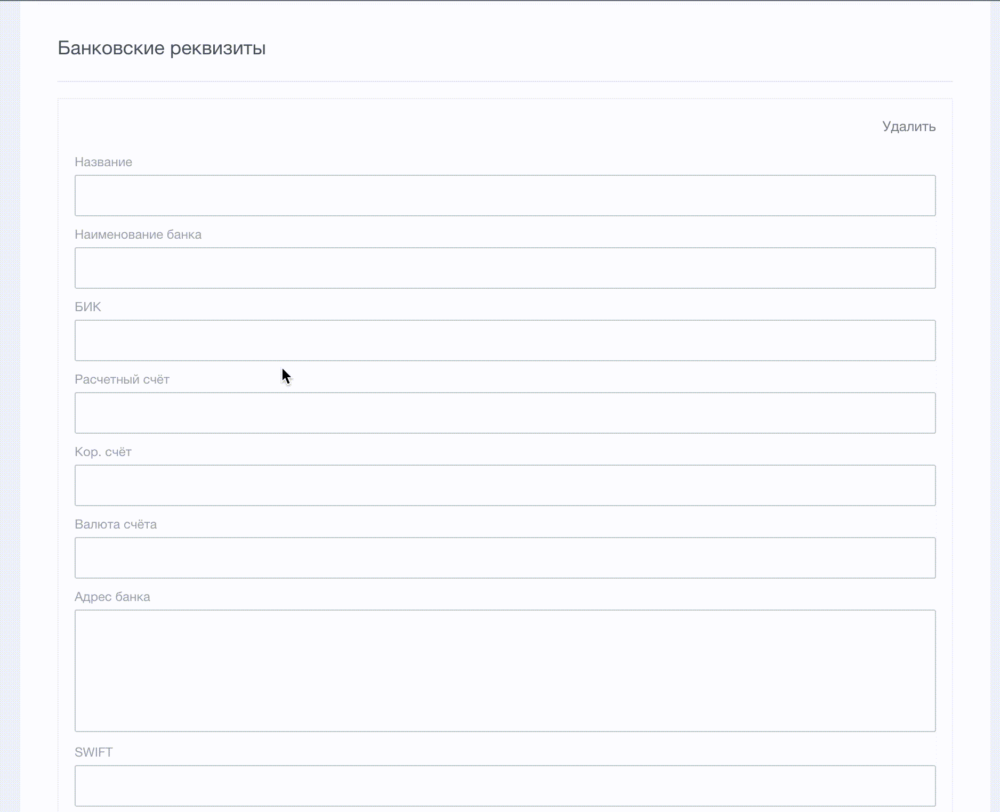

# Реквизиты банка по его БИК
Модуль для 1C-Битрикс24

## Описание
С этим решением при заполнении реквизитов в модуле CRM для банка достаточно указать только БИК, а наименование банка, адрес и корреспондентский счет подтянутся автоматически с bik-info.ru

Для некорректного БИК поле ввода будет подсвечено красной рамкой.

## Установка
### Marketplace 1С-Битрикс
[Установить из Marketplace](https://marketplace.1c-bitrix.ru/solutions/prilepa.b24crmbik/)

Устанавливается как обычно, начинает работать сразу после инсталляции.

Цепляется на вывод штатного компонента bitrix:crm.requisite.edit по событию main:OnBeforeProlog и подключает свой js.

Используется jQuery.
